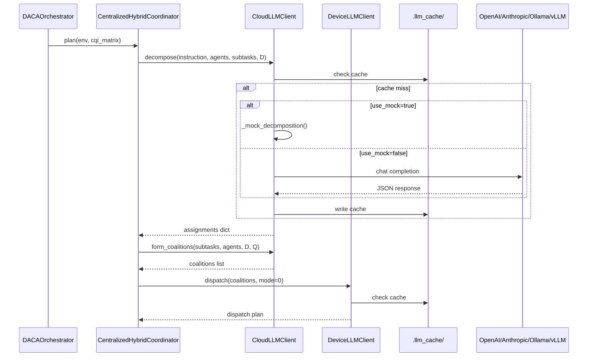
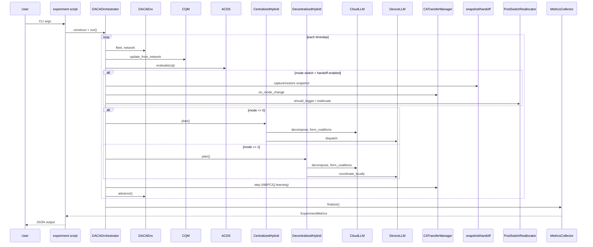

# DACA-HMAS — Complete Official Documentation

**Dynamic Architecture and Coalition Adaptation for Heterogeneous Multi-Agent Systems**

| Field | Value |
|-------|-------|
| Package name | `daca-hmas` |
| Version | `0.1.0` (from `pyproject.toml`) |
| Python | `>= 3.11` |
| Base paper extended | AutoHMA-LLM (Yang et al., IEEE TCCN 2025) |
| Repository root | `daca-hmas/` |

> **This document is the single source of truth for the repository.** It is reverse-engineered from actual source files. Anything not present in the codebase is explicitly marked **Not present in repository.**

---

## Table of Contents

1. [Project Overview](#project-overview)
2. [Why DACA-HMAS?](#why-daca-hmas)
3. [High-Level Architecture](#high-level-architecture)
4. [Complete Execution Flow](#complete-execution-flow)
5. [Repository Tree](#repository-tree)
6. [Folder Reference](#folder-reference)
7. [Module Reference (`src/`)](#module-reference-src)
8. [Configuration Files](#configuration-files)
9. [Mathematical Modules](#mathematical-modules)
10. [LLM Pipeline](#llm-pipeline)
11. [Network Simulation](#network-simulation)
12. [Experiment Pipeline](#experiment-pipeline)
13. [Module Interaction](#module-interaction)
14. [File Relationship Map](#file-relationship-map)
15. [Code Walkthrough](#code-walkthrough)
16. [Debugging Guide](#debugging-guide)
17. [Developer Guide](#developer-guide)
18. [Project Extension Guide](#project-extension-guide)
19. [Known Limitations](#known-limitations)
20. [Information Missing from INSTRUCTION.md](#information-missing-from-instructionmd)

---

# Project Overview

## Problem Statement

Heterogeneous multi-agent systems (HMAS) coordinating UAVs, ground vehicles, and robots must simultaneously solve **task planning**, **agent coalition formation**, **motion control**, and **communication management**. The base framework AutoHMA-LLM combines Cloud LLMs, Device LLMs, and classical controllers but leaves two critical gaps:

1. **Distance-agnostic task allocation** — spatial constraints defined in Section III (Eqs. 4–7) are never propagated into task decomposition (Eq. 12) or coalition formation (Eq. 15).
2. **Static architecture selection** — communication architecture (Centralized Hybrid vs. Decentralized Hybrid) is chosen once at deployment, despite AutoHMA-LLM's own experiments showing no single architecture is universally optimal.

**DACA-HMAS** closes both gaps with a unified shared state `{D(t), Q(t), m(t)}` consumed across decomposition, coalition formation, architecture switching, and reallocation.

## Research Motivation

Real-world HMAS deployments (warehouse logistics, infrastructure inspection, search & rescue) operate under **continuously varying communication quality**. A system locked into Centralized Hybrid fails when Cloud-to-Device links degrade; a system locked into Decentralized Hybrid under-utilizes global planning when communication is stable. Coalition assignments that ignore inter-agent distance produce physically infeasible groupings.

## Research Gap

| Gap | Location in AutoHMA-LLM | DACA-HMAS Fix |
|-----|------------------------|---------------|
| Gap 1 — Distance-agnostic decomposition | Eq. 12: `T = LLM(I,E,Δ)` | Extended Eq. 12 with `D(t)` + `δᵢᵢ'ⱼ` feasibility |
| Gap 2 — Static architecture | Fig. 3, deployment-time choice | Runtime `m(t)` via CQM + ACDS hysteresis |
| Gap 3 — Distance-agnostic coalitions | Eq. 15: `A(T) = LLM(T,S)` | Extended Eq. 25 with `D(t)`, `Q(t)`, `Γₖ ≥ Γ_min` |

## Objectives

1. Monitor communication quality passively from existing traffic (no extra messages).
2. Switch between Centralized Hybrid (`m=0`) and Decentralized Hybrid (`m=1`) at runtime.
3. Enforce distance- and communication-feasible task decomposition and coalition formation.
4. Preserve task state and collision-avoidance continuity during architecture transitions.
5. Reallocate infeasible coalitions locally after switches.
6. Validate via ablation experiments (B1/B2 baselines, A1–A5 ablations, full sweep).

## Research Contributions (as implemented)

| # | Contribution | Module | Key Equations |
|---|-------------|--------|---------------|
| C1 | Communication Quality Monitor | `src/cqm/monitor.py` | Eqs. 17–19 |
| C2 | Runtime Architecture Switching (ACDS) | `src/acds/switch_engine.py` | Eqs. 16, 20–22 |
| C3 | Distance-Aware Coalition Formation | `src/coalition/` | Eqs. 23–27 |
| C4 | State Snapshot Handoff + CA Transfer | `src/handoff/` | Eqs. 28–30 |
| C5 | Post-Switch Coalition Reallocation | `src/reallocation/post_switch.py` | Eq. 31 |
| C6 | Experimental Validation | `experiments/` | Metrics: Success, TFR, CFR, SC |

**Gap 1 upstream fix** (distance-feasible decomposition) is implemented in `src/decomposition/distance_feasible_decomp.py` with TFR metric.

## Real-World Applications

- **Logistics** — warehouse package delivery with UAV/vehicle/robot teams (stable communication).
- **Inspection** — distributed infrastructure monitoring under degraded links (10% delay, 1% loss).
- **Search & Rescue** — disaster zone operations with moderate degradation and priority subtasks.

## Target Users

| User Type | Use Case |
|-----------|----------|
| IEEE / academic researchers | Reproduce and extend AutoHMA-LLM experiments |
| Robotics engineers | Integrate LLM-based multi-agent coordination |
| ML systems engineers | Deploy Cloud + local Device LLM pipelines on GPU |
| Open-source contributors | Extend scenarios, controllers, metrics |

## Expected Outcomes

After running experiments, JSON result files contain:

- `success_rate` (%), `steps`, `tokens`, `api_calls`, `memory_mb`, `computation_s`
- `tfr` (Task Feasibility Rate), `cfr` (Coalition Feasibility Rate), `switch_count` (SC)

---

# Why DACA-HMAS?

## Limitations of AutoHMA-LLM

1. **Distance constraints unused in allocation** — `C₁` and `dist(·,·)` defined in Eqs. 4–7 but Eq. 15 coalition formation takes only `(T, S)`.
2. **Architecture frozen at deploy-time** — six static modes in Fig. 3; no runtime adaptation.
3. **No communication quality sensing** — no CQI or equivalent scalar for switching decisions.
4. **No safe transition protocol** — no formal state snapshot or CA continuity guarantee during mode changes.

## Why DACA-HMAS Was Proposed

AutoHMA-LLM Tables I–II show Centralized Hybrid wins in logistics (stable comm) while Decentralized Hybrid wins in inspection (degraded comm). This proves optimal architecture is a **function of runtime communication quality**, not a fixed property.

## Main Improvements

| Area | AutoHMA-LLM | DACA-HMAS |
|------|-------------|-----------|
| Architecture | Static | Runtime `m(t)` with hysteresis |
| Decomposition | `LLM(I,E,Δ)` | `LLM(I,E,Δ,D(t))` + post-validation |
| Coalition | `LLM(T,S)` | `LLM(T,S,D(t),Q(t))` + `Γₖ ≥ Γ_min` |
| Handoff | None | `G(t*)` snapshot + CA overlap window |
| Reallocation | None | `REALLOC(t*)` via Device LLM |

## Research Novelty

Single shared state object `{D(t), Q(t), m(t)}` consumed at **both** decomposition and coalition stages, coupled with communication-driven architecture switching — not two disconnected patches.

## Benefits

- Higher task success under dynamic communication (target: paper claims 5.7% accuracy improvement).
- Fewer infeasible coalitions (CFR → 1).
- Stable switching under noisy CQI (hysteresis reduces SC).
- Reproducible ablation matrix (B1–B2, A1–A5).

## Trade-offs

| Benefit | Cost |
|---------|------|
| Runtime adaptation | Switching overhead + handoff latency |
| Distance validation | Extra computation per replan step |
| Dual LLM stack | Cloud API cost + local GPU requirement |
| LLM-based planning | Non-deterministic outputs; hard validators required |

---

# High-Level Architecture

```mermaid
flowchart TB
    subgraph entry [Entry Points]
        EXP1["run_baseline_autohma.py"]
        EXP2["run_daca_hmas.py"]
        EXP3["run_full_sweep.py"]
    end

    subgraph orch [Orchestrator Layer]
        ORCH["DACAOrchestrator"]
        CFG["DACAConfig / CONFIGS"]
    end

    subgraph cloud [Cloud Layer m=0]
        CLLM["CloudLLMClient"]
        DECOMP["DistanceFeasibleDecomposer"]
        COAL["CoalitionFormation"]
        CENT["CentralizedHybridCoordinator"]
    end

    subgraph device [Device Layer]
        DLLM["DeviceLLMClient"]
        DECENT["DecentralizedHybridCoordinator"]
        CQM["CommunicationQualityMonitor"]
    end

    subgraph adapt [Adaptation Layer]
        ACDS["ACDSSwitchEngine"]
        HANDOFF["snapshot.py + ca_transfer.py"]
        REALLOC["PostSwitchReallocator"]
    end

    subgraph sim [Simulation Layer]
        ENV["DACAEnv"]
        AGENTS["AgentFleet"]
        NET["NetworkConditionGenerator"]
        SCEN["Scenario / Subtask"]
    end

    subgraph control [Control Layer]
        NMPC["NMPCController"]
        PID["PIDController"]
        QL["QLearningCA"]
        CAT["CATransferManager"]
    end

    subgraph metrics [Metrics Layer]
        MET["MetricsCollector"]
        EVAL["ExperimentMetrics"]
    end

    subgraph config [Configuration]
        TH["thresholds.yaml"]
        LLM["llm.yaml"]
        CFGMOD["src/config.py"]
    end

    EXP1 --> ORCH
    EXP2 --> ORCH
    EXP3 --> ORCH
    CFG --> ORCH
    TH --> CFGMOD
    LLM --> CFGMOD
    CFGMOD --> ORCH

    ORCH --> ENV
    ORCH --> CQM
    ORCH --> ACDS
    ORCH --> CENT
    ORCH --> DECENT
    ORCH --> HANDOFF
    ORCH --> REALLOC
    ORCH --> CAT
    ORCH --> MET

    CENT --> CLLM
    CENT --> DECOMP
    CENT --> COAL
    CENT --> DLLM
    DECENT --> CLLM
    DECENT --> DLLM

    ENV --> AGENTS
    ENV --> NET
    ENV --> SCEN

    CAT --> NMPC
    CAT --> QL
    NMPC --> PID

    MET --> EVAL
```



### Architecture Mode Variable

| `m(t)` | Mode | Planning Authority | CA Mechanism |
|--------|------|-------------------|--------------|
| `0` | Centralized Hybrid | Cloud LLM plans; Device LLM dispatches | NMPC + PID (global) |
| `1` | Decentralized Hybrid | Device LLM coordinates locally | Q-learning (local) |

---

# Complete Execution Flow

```mermaid
flowchart TD
    A["User runs experiment script"] --> B["argparse parses CLI args"]
    B --> C["CONFIGS[key] selects DACAConfig flags"]
    C --> D["DACAOrchestrator.__post_init__"]
    D --> E["Load thresholds.yaml + llm.yaml"]
    E --> F["DACAEnv: scenario + fleet + network"]
    F --> G["run(): env.reset()"]
    G --> H{"For each step t < max_steps"}

    H --> I["NetworkConditionGenerator.simulate_message per node"]
    I --> J{"use_cqm?"}
    J -->|yes| K["CQM.update_from_network"]
    J -->|no| L["sys_cqi = 1.0"]
    K --> M["CQM.update_pairwise → Q(t)"]
    M --> N["CQM.system_cqi()"]
    L --> O{"use_acds AND static_mode is None?"}
    N --> O
    O -->|yes| P["ACDS.evaluate(sys_cqi) → mode"]
    O -->|no| Q["mode = acds.mode fixed"]

    P --> R{"mode changed AND use_handoff?"}
    Q --> R
    R -->|yes| S["capture_snapshot → restore_snapshot"]
    S --> T["CATransferManager.on_mode_change"]
    T --> U{"use_reallocation AND should_trigger?"}
    U -->|yes| V["PostSwitchReallocator.reallocate"]
    U -->|no| W["verify_task_preservation"]
    V --> W
    R -->|no| X{"step % replan_interval == 0?"}
    W --> X

    X -->|yes| Y{"mode == 0?"}
    Y -->|yes| Z["CentralizedHybridCoordinator.plan"]
    Y -->|no| AA["DecentralizedHybridCoordinator.plan"]
    Z --> AB["Cloud LLM decompose + coalition"]
    AA --> AB
    AB --> AC["Device LLM dispatch or coordinate"]

    X -->|no| AD["Use cached assignments/coalitions"]
    AC --> AD

    AD --> AE{"use_distance_decomp?"}
    AE -->|yes| AF["compute_tfr → tfr_history"]
    AE -->|no| AG{"use_coalition_feasibility?"}
    AF --> AG
    AG -->|yes| AH["compute_cfr → cfr_history"]
    AG -->|no| AI["CATransferManager.step"]
    AH --> AI

    AI --> AJ["Check agent proximity to subtask targets"]
    AJ --> AK["env.mark_subtask_complete if dist < 8.0"]
    AK --> AL["env.advance()"]
    AL --> AM{"mission_complete?"}
    AM -->|yes| AN["MetricsCollector.finalize"]
    AM -->|no| H
    AN --> AO["Return ExperimentMetrics JSON"]
```



### Stage-by-Stage Explanation

| Stage | Module | What Happens |
|-------|--------|--------------|
| Configuration loaded | `src/config.py` | `thresholds.yaml` and `llm.yaml` parsed via `get_thresholds()`, `get_llm_config()` |
| Environment initialized | `DACAEnv` | Scenario built, fleet created, network generator attached |
| Communication profile | `NetworkConditionGenerator` | Synthetic loss/latency/bandwidth per timestep |
| Cloud LLM planning | `CloudLLMClient` | Decomposition and coalition prompts (or mock responses) |
| Task decomposition | `DistanceFeasibleDecomposer` (if A1/A5) | LLM output validated against `δᵢᵢ'ⱼ` |
| Coalition formation | `CoalitionFormation` (if A2/A5) | LLM output validated against `Ψᵢⱼ`, `Γₖ` |
| Local LLM reasoning | `DeviceLLMClient` | Dispatch (m=0) or coordinate (m=1) |
| Controllers execute | `CATransferManager` | NMPC/PID and/or Q-learning move agents |
| Communication monitored | `CommunicationQualityMonitor` | Lₙ, τ̂ₙ, Bₙ → CQI |
| Architecture switching | `ACDSSwitchEngine` | Dual-threshold hysteresis on CQI |
| Task reallocation | `PostSwitchReallocator` | Device LLM reallocates if CFR < 1 after switch |
| Metrics | `MetricsCollector` | Aggregates Success, TFR, CFR, SC, tokens, etc. |

---

# Repository Tree

Exact structure as present in the repository (excluding `.git/` internals and build artifacts):

```
daca-hmas/
├── .env.example
├── .gitignore
├── Instruction.md              # GPU setup guide (note: README.md links INSTRUCTION.md)
├── MANIFEST.in
├── README.md
├── README1.md                  # This file
├── pyproject.toml
├── configs/
│   ├── llm.yaml
│   └── thresholds.yaml
├── daca_hmas.egg-info/         # Generated by pip install -e
│   ├── PKG-INFO
│   ├── SOURCES.txt
│   ├── dependency_links.txt
│   ├── requires.txt
│   └── top_level.txt
├── experiments/
│   ├── configs/
│   │   ├── baseline_inspection.yaml
│   │   ├── baseline_logistics.yaml
│   │   └── full_daca_inspection.yaml
│   ├── run_baseline_autohma.py
│   ├── run_daca_hmas.py
│   └── run_full_sweep.py
├── src/
│   ├── __init__.py
│   ├── config.py
│   ├── acds/
│   │   ├── __init__.py          # empty
│   │   └── switch_engine.py
│   ├── coalition/
│   │   ├── __init__.py          # empty
│   │   ├── feasibility.py
│   │   └── formation.py
│   ├── control/
│   │   ├── __init__.py          # empty
│   │   ├── nmpc.py
│   │   ├── pid.py
│   │   └── q_learning.py
│   ├── coordination/
│   │   ├── __init__.py          # empty
│   │   ├── centralized_hybrid.py
│   │   ├── decentralized_hybrid.py
│   │   └── orchestrator.py
│   ├── cqm/
│   │   ├── __init__.py          # empty
│   │   └── monitor.py
│   ├── decomposition/
│   │   ├── __init__.py          # empty
│   │   └── distance_feasible_decomp.py
│   ├── env/
│   │   ├── __init__.py          # empty
│   │   ├── agents.py
│   │   ├── daca_env.py
│   │   ├── network_conditions.py
│   │   └── scenarios.py
│   ├── handoff/
│   │   ├── __init__.py          # empty
│   │   ├── ca_transfer.py
│   │   └── snapshot.py
│   ├── llm/
│   │   ├── __init__.py          # empty
│   │   ├── cloud_llm_client.py
│   │   ├── device_llm_client.py
│   │   └── prompts/
│   │       ├── __init__.py
│   │       ├── coalition.txt
│   │       ├── coordinate.txt
│   │       ├── decomposition.txt
│   │       ├── dispatch.txt
│   │       └── reallocate.txt
│   ├── metrics/
│   │   ├── __init__.py          # empty
│   │   └── evaluation.py
│   └── reallocation/
│       ├── __init__.py          # empty
│       └── post_switch.py
└── tests/
    ├── conftest.py
    ├── test_acds.py
    ├── test_cqm.py
    ├── test_decomposition.py
    ├── test_feasibility.py
    ├── test_handoff.py
    └── test_integration.py
```

### Directories Not Present in Repository

| Path | Status |
|------|--------|
| `scripts/` | Not present in repository |
| `docs/` | Not present in repository |
| `assets/` | Not present in repository |
| `examples/` | Not present in repository |
| `models/` | Not present in repository |
| `data/` | Not present in repository |
| `notebooks/` | Not present in repository |
| `logs/` | Not present in repository |
| `experiments/results/` | Created at runtime by experiment scripts |
| `.llm_cache/` | Created at runtime when LLM caching enabled |

### Files Not Present in Repository

| File | Status |
|------|--------|
| `requirements.txt` | Not present in repository (dependencies in `pyproject.toml`) |
| `setup.py` | Not present in repository |
| `Dockerfile` | Not present in repository |
| `Makefile` | Not present in repository |
| `LICENSE` | Not present in repository |
| `environment.yml` | Not present in repository |
| `INSTRUCTION.md` | Not present in repository (file on disk is `Instruction.md`) |

---

# Folder Reference

## `configs/`

| Attribute | Detail |
|-----------|--------|
| **Purpose** | Central YAML configuration for thresholds, scenarios, kinematics, and LLM providers |
| **Responsibilities** | Supply all tunable parameters to `src/config.py` loaders |
| **Why it exists** | Decouple experiment parameters from code; enable reproducibility |
| **Inputs** | None (static files) |
| **Outputs** | Python `dict` objects via `get_thresholds()`, `get_llm_config()` |
| **Loaded by** | `src/config.py` → all modules that import `get_thresholds` or `get_llm_config` |
| **Execution order** | First — before any module initialization in `DACAOrchestrator.__post_init__` |

### `configs/thresholds.yaml`

See [Configuration Files](#configuration-files) for full parameter table.

### `configs/llm.yaml`

See [LLM Pipeline](#llm-pipeline).

---

## `src/`

| Attribute | Detail |
|-----------|--------|
| **Purpose** | Core framework implementation |
| **Why it exists** | Contains all DACA-HMAS logic modules |
| **Dependency hierarchy** | `config` → `env` → `llm` / `control` → `cqm` / `acds` / `decomposition` / `coalition` / `handoff` / `reallocation` → `coordination` → `metrics` |
| **Data flow** | `DACAEnv` state → distance/CQI matrices → LLM prompts → validated assignments → controllers → metrics |

### Module Communication Order (per simulation step)

1. `DACAEnv` provides fleet positions
2. `NetworkConditionGenerator` simulates message delivery
3. `CommunicationQualityMonitor` computes CQI
4. `ACDSSwitchEngine` evaluates mode
5. Coordinator (`centralized` or `decentralized`) plans via LLMs
6. `CATransferManager` executes motion
7. `DACAEnv` advances timestep
8. `MetricsCollector` records at end

---

## `experiments/`

| Attribute | Detail |
|-----------|--------|
| **Purpose** | CLI entry points for baseline, ablation, and full-sweep runs |
| **Responsibilities** | Parse arguments, construct `DACAOrchestrator`, write JSON results |
| **Inputs** | CLI flags + `configs/` |
| **Outputs** | JSON files under `experiments/results/` (created at runtime) |
| **Does not** | Load `experiments/configs/*.yaml` automatically — YAML files are reference templates only |

---

## `tests/`

| Attribute | Detail |
|-----------|--------|
| **Purpose** | Unit and integration tests for pure-math modules |
| **Runner** | `pytest` (configured in `pyproject.toml`: `testpaths = ["tests"]`, `pythonpath = ["."]`) |
| **Fixtures** | `tests/conftest.py` adds project root to `sys.path` |

---

# Module Reference (`src/`)

## `src/config.py`

| Function | Purpose | Returns |
|----------|---------|---------|
| `load_yaml(name)` | Read `configs/{name}` | `dict` |
| `get_thresholds()` | Load `thresholds.yaml` | `dict` |
| `get_llm_config()` | Load `llm.yaml` | `dict` |
| `project_root()` | Return package root `Path` | `Path` |

**Called by:** `cloud_llm_client.py`, `device_llm_client.py`, `cqm/monitor.py`, `acds/switch_engine.py`, `orchestrator.py`

---

## `src/env/`

### Purpose

Simulation environment: heterogeneous agents, mission scenarios, synthetic network degradation, and the main `DACAEnv` wrapper.

### `agents.py`

#### Classes

| Class | Purpose | Key Attributes |
|-------|---------|----------------|
| `AgentType` | Enum: `uav`, `vehicle`, `robot` | — |
| `Position` | 3D point `(x,y,z)` | `x`, `y`, `z`; method `as_array()` |
| `AgentState` | Single agent state | `agent_id`, `agent_type`, `position`, `heading`, `speed`, `skills`, `assigned_subtasks`, `completed_subtasks`, `remaining_waypoints`, `coalition_id` |
| `KinematicsConfig` | Speed/turn limits | `max_speed`, `max_turn_rate` |
| `AgentFleet` | Fleet manager | `agents`, `kinematics`, `c1`, `c2`, `_id_to_idx` |

#### Functions

| Function | Purpose | Returns |
|----------|---------|---------|
| `dist(p1, p2)` | Euclidean distance (Eqs. 4–5) | `float` |
| `distance_matrix(agents)` | N×N matrix D(t) | `np.ndarray` |
| `create_fleet_from_scenario(cfg, kinematics, c1, c2, seed)` | Build fleet from scenario config | `AgentFleet` |

#### `AgentFleet` Methods

| Method | Purpose |
|--------|---------|
| `get_agent(agent_id)` | Lookup by ID |
| `step_toward(agent_id, target, dt=0.1)` | Point-mass kinematic step with turn-rate limit |
| `check_proximity_constraint()` | Eq. 6 — inter-type proximity ≥ C2 |
| `check_communication_range()` | Eq. 7 — all pairs within C1 |
| `to_dict_list()` | Serialize for LLM prompts |

**Note:** `check_proximity_constraint()` and `check_communication_range()` exist but are **not called** from the orchestrator loop in the current codebase.

### `scenarios.py`

#### Classes

| Class | Attributes |
|-------|------------|
| `Subtask` | `subtask_id`, `description`, `target`, `required_skills`, `assigned_agents`, `completed`, `priority` |
| `Scenario` | `name`, `instruction`, `subtasks`, `agent_config`, `comm_delay_prob`, `packet_loss_rate` |

#### Functions

| Function | Builds |
|----------|--------|
| `build_logistics_scenario(cfg, seed)` | 6 subtasks, stable comm |
| `build_inspection_scenario(cfg, seed)` | 8 subtasks, 10% delay, 1% loss |
| `build_search_rescue_scenario(cfg, seed)` | 10 subtasks, high-priority first 3 |
| `get_scenario(name, thresholds, seed)` | Dispatcher via `SCENARIO_BUILDERS` |

### `network_conditions.py`

#### Classes

| Class | Purpose |
|-------|---------|
| `NetworkProfile` | Enum: `stable`, `gradual`, `sudden`, `oscillatory` |
| `NetworkState` | Single message simulation result: loss, latency, bandwidth, ACK counts |
| `NetworkConditionGenerator` | Time-varying degradation injector |

#### `NetworkConditionGenerator` Methods

| Method | Behavior |
|--------|----------|
| `loss_rate_at(t)` | Profile-dependent loss rate |
| `latency_at(t)` | Base + loss-dependent + random jitter |
| `bandwidth_at(t)` | `max(0, 1 - loss - delay_factor)` |
| `simulate_message(t, payload_bytes=256)` | Returns `NetworkState` with probabilistic ACK |
| `from_scenario(name, profile, thresholds, seed, total_steps)` | Factory from scenario config |

### `daca_env.py`

#### Classes

| Class | Purpose |
|-------|---------|
| `EnvState` | `timestep`, `mode`, `mission_complete`, `completed_subtasks` |
| `DACAEnv` | Main environment wrapper |

#### `DACAEnv` Methods

| Method | Purpose |
|--------|---------|
| `reset()` | Rebuild scenario + fleet |
| `get_observation()` | Dict with agents, subtasks, distance matrix, instruction |
| `step_agents_toward_targets(assignments)` | Direct kinematic stepping |
| `mark_subtask_complete(subtask_id)` | Mark subtask done |
| `check_mission_complete()` | All subtasks completed? |
| `advance()` | Increment timestep; set `mission_complete` if done or `max_steps` reached |
| `success_rate()` | `completed / total` subtasks |

**Inference:** `DACAEnv` is documented as "Gymnasium-style" but does **not** inherit from `gymnasium.Env`. The `gymnasium` package is listed in dependencies but is not imported in `daca_env.py`.

---

## `src/cqm/`

### Purpose

Communication Quality Monitor — passive sensing from instruction-feedback traffic.

### Class: `CommunicationQualityMonitor`

| Method | Equation | Description |
|--------|----------|-------------|
| `packet_loss_rate(node_id)` | Eq. 17a | `Lₙ = 1 - ACK/MSG` |
| `normalized_latency(node_id)` | Eq. 17b | `τ̂ₙ ∈ [0,1]` |
| `bandwidth_availability(node_id)` | Eq. 17c | Sliding window bytes ratio |
| `node_cqi(node_id)` | Eq. 18 | Weighted sum of (1-L), (1-τ̂), B |
| `system_cqi()` | Eq. 19 | Mean over all nodes |
| `update_from_network(node_id, net)` | — | Ingest `NetworkState` |
| `update_pairwise(dist_mat, c1)` | — | Build Q(t): sys_cqi if in range, else 0 |
| `from_config(thresholds, n_nodes)` | — | Factory |

### Class: `NodeStats`

Per-node accumulators: `msg_sent`, `ack_received`, `latencies` (deque maxlen 50), `bytes_delivered`, `bytes_capacity` (deque maxlen `bandwidth_window`).

---

## `src/acds/`

### Purpose

Architecture Control and Decision Switching — dual-threshold hysteresis FSM.

### Class: `ACDSSwitchEngine`

| Attribute | Default | Meaning |
|-----------|---------|---------|
| `theta_down` | 0.57 | CQI threshold to switch Centralized → Decentralized |
| `theta_up` | 0.73 | CQI threshold to switch Decentralized → Centralized |
| `persistence_window` | 5 | N consecutive intervals required |
| `use_hysteresis` | True | If False, uses midpoint threshold (A4 ablation) |
| `mode` | 0 | Current architecture mode |
| `switch_count` | 0 | SC metric accumulator |

| Method | Purpose |
|--------|---------|
| `evaluate(cqi)` | Eq. 20 — may increment `switch_count` and update `mode` |
| `switch_count_metric()` | Eq. 22 — return SC |
| `from_config(thresholds, use_hysteresis)` | Set θ from `cqi_crossover ± delta` |

**State transitions:**

```
m=0 + CQI < θ_down for N steps → m=1
m=1 + CQI > θ_up for N steps → m=0
otherwise → m unchanged
```

---

## `src/decomposition/`

### Purpose

Distance-feasible task decomposition (Gap 1, extended Eq. 12).

### Functions

| Function | Purpose |
|----------|---------|
| `delta_feasibility(agent_i, agent_j, subtask, c_task, r_reach)` | `δᵢᵢ'ⱼ(t)` indicator product |
| `subtask_feasibility_matrix(agents, subtask, c_task, r_reach)` | Dⱼ(t) matrix |
| `validate_joint_assignment(agent_ids, subtask, fleet, c_task, r_reach)` | All pairs feasible? |
| `compute_tfr(assignments, subtasks, fleet, c_task, r_reach)` | Task Feasibility Rate |

### Class: `DistanceFeasibleDecomposer`

| Method | Flow |
|--------|------|
| `decompose(instruction, fleet, subtasks)` | Cloud LLM → validate each assignment → greedy fallback if invalid |
| `_find_feasible_agents(subtask, fleet)` | Nearest agent within `R_reach` |

---

## `src/coalition/`

### `feasibility.py` — Pure Functions

| Function | Equation |
|----------|----------|
| `pairwise_feasibility(dist_ij, cqi_ij, c1)` | Eq. 23: Ψᵢⱼ |
| `build_psi_matrix(D, Q, c1)` | Full Ψ matrix |
| `coalition_feasibility_score(members, psi)` | Eq. 24: Γₖ min-pair |
| `coalition_feasibility_rate(coalitions, psi, gamma_min)` | Eqs. 26–27: CFR |
| `validate_coalition_members(ids, id_to_idx, psi, gamma_min)` | Boolean check |

### `formation.py` — Class: `CoalitionFormation`

| Method | Flow |
|--------|------|
| `form(fleet, subtasks, D, Q)` | LLM coalitions → validate → retry up to `max_retries` → repair infeasible by splitting to singletons |
| `compute_cfr(coalitions, fleet, D, Q)` | Runtime CFR for metrics |
| `_repair_infeasible(...)` | Split broken coalitions into single-agent groups |

---

## `src/handoff/`

### `snapshot.py`

| Class / Function | Purpose |
|----------------|---------|
| `AgentSnapshot` | Per-agent slice of G(t*) |
| `GlobalSnapshot` | Eq. 28 full state; `to_dict()`, `from_dict()` |
| `capture_snapshot(...)` | Build G(t*) from live fleet |
| `restore_snapshot(fleet, snapshot)` | Write snapshot back to fleet |
| `verify_task_preservation(before, after)` | Eq. 29 check |
| `slice_for_device(snapshot, agent_id)` | Per-Device-LLM slice |

**Inference:** `slice_for_device()` is implemented but **not called** from `orchestrator.py` in the current codebase.

### `ca_transfer.py` — Class: `CATransferManager`

| Method | Purpose |
|--------|---------|
| `activate_overlap_window(delta)` | Start concurrent CA period |
| `step(fleet, mode, assignments, targets)` | Run NMPC and/or Q-learning per mode/overlap |
| `phi_active(mode)` | Eq. 30 — at least one CA active? |
| `on_mode_change(new_mode)` | Activate Q-learning + overlap window |

---

## `src/reallocation/`

### Class: `PostSwitchReallocator`

| Method | Purpose |
|--------|---------|
| `should_trigger(mode_changed, coalitions, fleet, D, Q)` | Eq. 31: switch AND CFR < 1 |
| `reallocate(fleet, subtasks, coalitions, D, Q)` | Device LLM realloc → fallback to `CoalitionFormation.form()` |

---

## `src/llm/`

### `cloud_llm_client.py`

#### Class: `CloudLLMClient`

| Method | Purpose |
|--------|---------|
| `complete(prompt, system)` | Cache check → mock or API call → cache write |
| `decompose(instruction, agents, subtasks, distance_matrix)` | Template prompt → parse JSON assignments |
| `form_coalitions(subtasks, agents, D, Q)` | Template prompt → parse JSON coalitions |
| `_api_call(prompt, system)` | OpenAI or Anthropic HTTP API |
| `_mock_response(prompt)` | Rule-based JSON for testing |

**Not present in repository:** streaming, retry logic, conversation memory.

#### Class: `LLMUsage`

Tracks `tokens`, `api_calls`.

### `device_llm_client.py`

#### Class: `DeviceLLMClient`

| Method | Purpose |
|--------|---------|
| `complete(prompt)` | Cache → mock / Ollama / vLLM |
| `_ollama_call(prompt)` | POST `{base_url}/api/generate` |
| `_vllm_call(prompt)` | POST `{base_url}/chat/completions` (OpenAI-compatible) |
| `dispatch(coalitions, mode)` | Device dispatch prompt |
| `coordinate_locally(coalitions, local_state)` | Decentralized coordination prompt |
| `reallocate_remaining(...)` | Post-switch reallocation prompt |

**Not present in repository:** streaming, retry logic.

### `prompts/`

| File | Used By |
|------|---------|
| `decomposition.txt` | `CloudLLMClient.decompose()` |
| `coalition.txt` | `CloudLLMClient.form_coalitions()` |
| `dispatch.txt` | `DeviceLLMClient.dispatch()` |
| `coordinate.txt` | `DeviceLLMClient.coordinate_locally()` |
| `reallocate.txt` | `DeviceLLMClient.reallocate_remaining()` |

| Function | Purpose |
|----------|---------|
| `load_prompt(name)` | Read `{name}.txt` |
| `format_prompt(name, **kwargs)` | `str.format()` on template |

---

## `src/control/`

| Class | File | Role |
|-------|------|------|
| `PIDController` | `pid.py` | Repulsive collision avoidance offsets |
| `NMPCController` | `nmpc.py` | Horizon-based waypoint planning + PID execution |
| `QLearningCA` | `q_learning.py` | Tabular Q-learning for decentralized CA |

**Note:** `simple-pid` is in `pyproject.toml` dependencies but `pid.py` implements PID manually and does not import `simple_pid`.

### `PIDController`

| Method | Purpose |
|--------|---------|
| `compute_avoidance_offset(fleet, agent_id, target, dt)` | PID + repulsive forces from nearby agents |
| `step(fleet, assignments, targets)` | Move each assigned agent toward safe target |
| `reset()` | Clear integral/derivative state |

### `NMPCController`

| Method | Purpose |
|--------|---------|
| `plan_waypoint(fleet, agent_id, target)` | Search horizon steps for lowest-cost waypoint |
| `step(fleet, assignments, targets)` | Plan waypoints then delegate to PID |

### `QLearningCA`

| Method | Purpose |
|--------|---------|
| `step(fleet, assignments, targets)` | ε-greedy action selection + Q update + move |
| `warmup_step(fleet)` | Initialize Q-table entries during centralized mode |
| `activate()` / `standby_mode()` | Control `_standby` flag |

---

## `src/coordination/`

### `orchestrator.py`

#### Class: `DACAConfig`

Feature flags controlling which DACA-HMAS contributions are active:

| Field | Type | Meaning |
|-------|------|---------|
| `name` | str | Config ID (B1, A5, etc.) |
| `use_distance_decomp` | bool | Enable `DistanceFeasibleDecomposer` |
| `use_coalition_feasibility` | bool | Enable `CoalitionFormation` with validation |
| `use_cqm` | bool | Enable CQM updates |
| `use_acds` | bool | Enable runtime switching |
| `use_handoff` | bool | Enable snapshot + CA transfer on switch |
| `use_reallocation` | bool | Enable post-switch reallocation |
| `use_hysteresis` | bool | ACDS hysteresis band |
| `static_mode` | int \| None | If set, fixes m to 0 or 1 (B1/B2) |

#### `CONFIGS` Dictionary

| Key | static_mode | Features Enabled |
|-----|-------------|------------------|
| B1 | 0 | None (baseline centralized) |
| B2 | 1 | None (baseline decentralized) |
| A1 | 0 | Distance decomposition only |
| A2 | 0 | Coalition feasibility only |
| A3 | dynamic | CQM + ACDS |
| A4 | dynamic | CQM + ACDS without hysteresis |
| A5 | dynamic | All features |

#### Class: `DACAOrchestrator`

| Attribute | Default | Meaning |
|-----------|---------|---------|
| `max_steps` | 200 | Simulation horizon |
| `replan_interval` | 20 | Steps between LLM replanning |

| Method | Purpose |
|--------|---------|
| `__post_init__()` | Wire all subsystems |
| `run()` | Main simulation loop → `ExperimentMetrics` |

### `centralized_hybrid.py` — Class: `CentralizedHybridCoordinator`

| Method | Purpose |
|--------|---------|
| `plan(env, cqi_matrix)` | Decompose + form coalitions + `device_llm.dispatch(mode=0)` |
| `execute_step(env, assignments)` | NMPC stepping + completion check (dist < 5.0) |

**Inference:** `execute_step()` exists but the orchestrator uses `CATransferManager.step()` instead.

### `decentralized_hybrid.py` — Class: `DecentralizedHybridCoordinator`

| Method | Purpose |
|--------|---------|
| `plan(env, cqi_matrix)` | Decompose + coalitions + `device_llm.coordinate_locally()` |
| `execute_step(env, assignments)` | Q-learning stepping + completion check |

---

## `src/metrics/`

### Class: `ExperimentMetrics`

Dataclass holding all per-run results. Method `to_dict()` serializes to JSON-friendly dict (success_rate as percentage).

### Class: `MetricsCollector`

| Method | Purpose |
|--------|---------|
| `finalize(...)` | Build `ExperimentMetrics`, append to `records` |
| `summary_table()` | List of `to_dict()` for all records |
| `aggregate_by_config(records)` | Mean/std per config×scenario×profile |
| `significance_test(group_a, group_b)` | `scipy.stats.ttest_ind` |

### Metrics Reference

| Metric | Source | Formula / Meaning |
|--------|--------|-------------------|
| Success Rate | `DACAEnv.success_rate()` | completed_subtasks / total_subtasks |
| Steps | `env.state.timestep` | Simulation timesteps elapsed |
| Tokens | `cloud_llm.usage + device_llm.usage` | LLM token counts |
| API Calls | LLM usage counters | Total LLM invocations |
| Memory (MB) | `device_llm.usage.memory_mb` | Static report: 4096 mock, 8192+ real |
| Computation (s) | `time.perf_counter()` wall clock | |
| TFR | `compute_tfr()` history mean | Fraction of assignments passing δ feasibility |
| CFR | `compute_cfr()` history mean | Fraction of coalitions with Γₖ ≥ Γ_min |
| SC | `acds.switch_count_metric()` | Architecture switch count |

**Not present in repository:** GPU utilization metric, per-packet latency/bandwidth in output JSON, visualization generation.

---

# Configuration Files

## `configs/thresholds.yaml` — Complete Parameter Reference

| Parameter | Default | Module | Mathematical Role |
|-----------|---------|--------|-------------------|
| `C1` | 50.0 | coalition, cqm | Communication range (m) — Eq. 6, 23 |
| `C_task` | 30.0 | decomposition | Subtask collaboration radius (m) |
| `R_reach` | 100.0 | decomposition | Agent reach to subtask target (m) |
| `C2` | 5.0 | agents | Collision/proximity threshold (m) — Eq. 6 |
| `cqi_weights.w1` | 0.4 | cqm | Packet loss weight in CQI |
| `cqi_weights.w2` | 0.35 | cqm | Latency weight in CQI |
| `cqi_weights.w3` | 0.25 | cqm | Bandwidth weight in CQI |
| `latency.tau_min` | 0.01 | cqm | Best-case RTT (seconds) |
| `latency.tau_max` | 2.0 | cqm | Worst-case RTT (seconds) |
| `bandwidth_window` | 10 | cqm | W_B sliding window size |
| `acds.cqi_crossover` | 0.65 | acds | Center of hysteresis band |
| `acds.delta` | 0.08 | acds | Half-width δ of hysteresis band |
| `acds.persistence_window` | 5 | acds | N consecutive CQI readings |
| `gamma_min` | 0.3 | coalition | Minimum Γₖ for feasible coalition |
| `ca_overlap_delta` | 3 | handoff | CA overlap timesteps during switch |
| `kinematics.uav/vehicle/robot` | see file | agents | `max_speed`, `max_turn_rate` per type |
| `scenarios.*` | see file | scenarios, network | Agent counts, subtask counts, base comm degradation |

## `configs/llm.yaml` — Complete Parameter Reference

| Parameter | Default | Effect |
|-----------|---------|--------|
| `cloud.provider` | `openai` | `openai` or `anthropic` |
| `cloud.model` | `gpt-4o` | Cloud LLM model name |
| `cloud.max_tokens` | 1024 | Max response tokens |
| `cloud.temperature` | 0.2 | Sampling temperature |
| `cloud.api_key_env` | `OPENAI_API_KEY` | Environment variable name |
| `device.provider` | `ollama` | `ollama` or `vllm` |
| `device.model` | `llama3.1:8b` | Device LLM model |
| `device.base_url` | `http://localhost:11434` | Ollama/vLLM endpoint |
| `device.num_gpu` | -1 | Ollama GPU layers (-1 = all) |
| `device.memory_mb` | 8192 | Reported in metrics |
| `use_mock` | `true` | If true, no real API/GPU calls |
| `cache_responses` | `true` | SHA256-keyed JSON cache in `.llm_cache/` |
| `cache_dir` | `.llm_cache` | Cache directory relative to project root |

## `.env.example`

| Variable | Purpose |
|----------|---------|
| `OPENAI_API_KEY` | Cloud LLM authentication |
| `ANTHROPIC_API_KEY` | Alternative cloud provider (commented) |

---

# Mathematical Modules

## Distance Feasibility (Gap 1)

**Equation:** `δᵢᵢ'ⱼ(t) = 𝟙[dist(Pᵢ,Pⱼ) ≤ C_task] · 𝟙[dist(Pᵢ,targetⱼ) ≤ R_reach] · 𝟙[dist(Pⱼ,targetⱼ) ≤ R_reach]`

**Intuition:** Agents assigned to the same subtask must be close enough to collaborate AND close enough to reach the target. If any factor is zero, the joint assignment is rejected.

**Implementation:** `delta_feasibility()` in `distance_feasible_decomp.py`

## Task Feasibility Rate (TFR)

**Formula:** `TFR = (# assigned subtasks with all pairs feasible) / (# assigned subtasks)`

**Intuition:** Measures how often decomposition produces spatially valid assignments.

## Pairwise Communication Feasibility

**Equation:** `Ψᵢⱼ(t) = [dist(Pᵢ,Pⱼ) ≤ C₁] · CQIᵢⱼ(t)`

**Intuition:** Two agents can only coordinate if they are within radio range AND the link quality is non-zero.

## Coalition Feasibility Score

**Equation:** `Γₖ(t) = min_{i≠j ∈ Aₖ} Ψᵢⱼ(t)`

**Intuition:** A coalition is only as strong as its weakest link — one bad pair breaks coordination.

## Communication Quality Index

**Equations:**
- `Lₙ = 1 - ACK/MSG`
- `τ̂ₙ = (τₙ - τ_min) / (τ_max - τ_min)`
- `Bₙ = Σbytes_delivered / Σcapacity`
- `CQIₙ = w₁(1-Lₙ) + w₂(1-τ̂ₙ) + w₃Bₙ`
- `CQI = mean(CQIₙ)`

**Intuition:** Single scalar summarizing "how good is communication right now" from three degradation signals. CQI=1 is perfect; CQI=0 is total failure.

## Architecture Switching with Hysteresis

**Logic:**
- Start in m=0 (Centralized)
- If CQI < θ_down for N consecutive steps → switch to m=1
- If CQI > θ_up for N consecutive steps → switch to m=0
- θ_up > θ_down creates dead band preventing oscillation

**Intuition:** Like a thermostat with separate on/off thresholds to prevent rapid toggling.

## Post-Switch Reallocation

**Equation:** `REALLOC(t*) = 𝟙[switch occurred] · 𝟙[CFR < 1]`

**Intuition:** Only reallocate when a switch happened AND some coalitions are now broken.

## Task Preservation

**Equation:** `Σⱼ Tⱼ(before) = Σⱼ Tⱼ(after)` and completed sets identical.

**Intuition:** No subtask is lost or duplicated across a handoff boundary.

---

# LLM Pipeline



## Mock Mode vs Real Mode

| Setting | Cloud LLM | Device LLM |
|---------|-----------|------------|
| `use_mock: true` | `_mock_response()` rule-based JSON | `_mock_response()` rule-based JSON |
| `use_mock: false` | OpenAI or Anthropic API | Ollama `/api/generate` or vLLM `/chat/completions` |

## Token Accounting

- Cloud: `CloudLLMClient.usage.tokens`, `usage.api_calls`
- Device: `DeviceLLMUsage.tokens`, `usage.api_calls`, `memory_mb`
- Mock mode: token count = `len(prompt.split()) + len(response.split())`

## Caching

- Key: SHA256 of prompt (device: includes `node_id` prefix)
- Path: `.llm_cache/cloud_{hash}.json` or `device_{hash}.json`
- Controlled by `cache_responses` in `llm.yaml`

**Not present in repository:** retry on API failure, streaming responses, conversation history across steps.

---

# Network Simulation

## Profiles (`NetworkConditionGenerator`)

| Profile | `loss_rate_at(t)` Behavior |
|---------|---------------------------|
| `stable` | Constant `base_loss_rate` |
| `gradual` | `base + 0.15 * (t / total_steps)` |
| `sudden` | `base + 0.20` after 40% of mission |
| `oscillatory` | `base + 0.10 * (0.5 + 0.5*sin(2πt/50))` |

## Scenario Base Parameters

| Scenario | `comm_delay_prob` | `packet_loss_rate` |
|----------|-------------------|-------------------|
| logistics | 0.0 | 0.0 |
| inspection | 0.10 | 0.01 |
| search_rescue | 0.05 | 0.005 |

## How Network Affects Planning

1. `simulate_message()` → `NetworkState` with probabilistic ACK
2. CQM accumulates loss/latency/bandwidth → `system_cqi()`
3. ACDS uses CQI to switch architecture (A3/A4/A5)
4. CQM builds Q(t) matrix used in coalition formation (A2/A5)
5. Lower CQI → more zero entries in Q(t) → lower Ψᵢⱼ → lower Γₖ → coalition repair/reallocation

---

# Experiment Pipeline

## `experiments/run_baseline_autohma.py`

| Attribute | Value |
|-----------|-------|
| **Purpose** | Run B1 (centralized) or B2 (decentralized) baseline |
| **CLI** | `--scenario`, `--architecture`, `--profile`, `--seed`, `--max-steps`, `--output` |
| **Output** | JSON to stdout; optional file via `--output` |
| **Config used** | `CONFIGS["B1"]` or `CONFIGS["B2"]` |

## `experiments/run_daca_hmas.py`

| Attribute | Value |
|-----------|-------|
| **Purpose** | Run single ablation config (A1–A5) with multiple seeds |
| **CLI** | `--config`, `--scenario`, `--profile`, `--seed`, `--seeds`, `--max-steps`, `--output-dir` |
| **Output** | Per-seed JSON + `summary_{config}_{scenario}_{profile}.json` |
| **Default output dir** | `experiments/results/` |

## `experiments/run_full_sweep.py`

| Attribute | Value |
|-----------|-------|
| **Purpose** | Full or quick ablation matrix |
| **CLI** | `--seeds`, `--max-steps`, `--output-dir`, `--quick` |
| **Full matrix** | 7 configs × 3 scenarios × 4 profiles × N seeds |
| **Quick matrix** | B1, B2, A5 × 2 scenarios × 2 profiles × min(seeds,2) |
| **Output** | `all_results.json`, `aggregate.json`, `significance.json` |

## `experiments/configs/*.yaml`

Reference templates only — **not loaded automatically** by experiment scripts.

## Statistical Testing

`MetricsCollector.significance_test()` runs independent t-test (`scipy.stats.ttest_ind`) between two success-rate groups. Used in `run_full_sweep.py` for B1-logistics vs B2-inspection comparison.

**Not present in repository:** visualization scripts, LaTeX table generation, W&B/MLflow integration.

---

# Module Interaction



---

# File Relationship Map

## Import Dependency Graph

```
experiments/*.py
  └── src/coordination/orchestrator.py
        ├── src/config.py
        ├── src/env/daca_env.py
        │     ├── src/env/agents.py
        │     ├── src/env/scenarios.py
        │     └── src/env/network_conditions.py
        ├── src/llm/cloud_llm_client.py
        │     ├── src/config.py
        │     └── src/llm/prompts/__init__.py
        ├── src/llm/device_llm_client.py
        ├── src/cqm/monitor.py
        ├── src/acds/switch_engine.py
        ├── src/decomposition/distance_feasible_decomp.py
        ├── src/coalition/formation.py
        │     └── src/coalition/feasibility.py
        ├── src/coordination/centralized_hybrid.py
        ├── src/coordination/decentralized_hybrid.py
        ├── src/handoff/snapshot.py
        ├── src/handoff/ca_transfer.py
        │     ├── src/control/nmpc.py → src/control/pid.py
        │     └── src/control/q_learning.py
        ├── src/reallocation/post_switch.py
        └── src/metrics/evaluation.py
```

## Call Hierarchy (runtime)

```
main() [experiment script]
  └── DACAOrchestrator.run()
        ├── env.reset()
        └── loop:
              ├── network.simulate_message()
              ├── cqm.update_from_network()
              ├── cqm.update_pairwise()
              ├── acds.evaluate()
              ├── [handoff block]
              ├── centralized.plan() OR decentralized.plan()
              │     ├── cloud_llm.decompose()
              │     ├── coalition_formation.form() OR cloud_llm.form_coalitions()
              │     └── device_llm.dispatch() OR coordinate_locally()
              ├── compute_tfr() [optional]
              ├── coalition_formation.compute_cfr() [optional]
              ├── ca_transfer.step()
              ├── env.mark_subtask_complete()
              └── env.advance()
        └── metrics.finalize()
```

---

# Code Walkthrough

## Entry Point

**First file executed:** One of:
- `experiments/run_baseline_autohma.py`
- `experiments/run_daca_hmas.py`
- `experiments/run_full_sweep.py`

Each script:
1. Adds project root to `sys.path`
2. Parses CLI with `argparse`
3. Selects `CONFIGS[key]`
4. Constructs `DACAOrchestrator(...)`
5. Calls `orch.run()`
6. Serializes `ExperimentMetrics.to_dict()` to JSON

## Initialization Sequence (`DACAOrchestrator.__post_init__`)

1. `DACAEnv(scenario, thresholds, network_profile, seed, max_steps)`
2. `CloudLLMClient(llm_cfg)` + `DeviceLLMClient(llm_cfg)`
3. `CommunicationQualityMonitor.from_config(thresholds, n_agents)`
4. `ACDSSwitchEngine.from_config(thresholds, use_hysteresis)`
5. If `static_mode` set → fix `acds.mode`
6. `DistanceFeasibleDecomposer`, `CoalitionFormation`
7. `CentralizedHybridCoordinator`, `DecentralizedHybridCoordinator`
8. `CATransferManager`, `PostSwitchReallocator`, `MetricsCollector`

## Main Loop Termination

Loop exits when:
- `env.state.mission_complete` is True (all subtasks done OR `timestep >= max_steps`), or
- `step` reaches `max_steps`

## Object Lifecycle

| Object | Created | Destroyed |
|--------|---------|-----------|
| `DACAOrchestrator` | Script start | Script end |
| `DACAEnv` | `__post_init__` | Script end |
| `assignments`, `coalitions` | First replan step | Overwritten every `replan_interval` |
| `GlobalSnapshot` | On mode switch | Garbage collected after handoff |
| LLM cache files | First API call | Persist across runs |

---

# Debugging Guide

| Problem | Likely Cause | Fix |
|---------|-------------|-----|
| `ModuleNotFoundError: src` | Wrong working directory | `cd daca-hmas`, activate venv, `pip install -e ".[dev]"` |
| `pytest` not found | Scripts not on PATH | `python -m pytest tests/ -v` |
| Empty assignments `{}` | Mock LLM parse failure | Check prompt format; inspect `.llm_cache/` |
| SC always 0 | `use_acds=False` or `static_mode` set | Use A3/A4/A5 config |
| CFR always 1.0 | `use_coalition_feasibility=False` | Use A2/A5; check `cfr_history` empty → defaults to 1.0 |
| TFR always 1.0 | `use_distance_decomp=False` | Use A1/A5 |
| Ollama connection error | Server not running | `ollama serve`; verify `curl localhost:11434/api/tags` |
| vLLM 404 | Wrong `base_url` | Must include `/v1` suffix for chat completions |
| OpenAI 401 | Missing API key | Set `OPENAI_API_KEY` in environment or `.env` |
| High API cost | `use_mock: false` + no cache | Enable `cache_responses: true`; use `--quick` sweep first |
| GPU not used (Ollama) | CPU-only install | Reinstall Ollama with CUDA; check `nvidia-smi` during `ollama run` |
| CUDA OOM (vLLM) | Model too large | Reduce `--gpu-memory-utilization`; use quantized model |

### Isolating Bugs by Config

| Symptom | Test Config | Isolates |
|---------|-------------|----------|
| Planning broken | B1 + `use_mock: true` | LLM + env only |
| CQI wrong | A3 only | CQM + ACDS |
| Coalition issues | A2 only | Coalition formation |
| Switch crashes | A5 with `oscillatory` profile | Handoff + reallocation |

---

# Developer Guide

## Add a New Scenario

1. Add entry under `scenarios:` in `configs/thresholds.yaml`
2. Create `build_{name}_scenario()` in `src/env/scenarios.py`
3. Register in `SCENARIO_BUILDERS` dict
4. Add choice to argparse `choices` in all three experiment scripts

## Add a New Controller

1. Create `src/control/{name}.py`
2. Integrate in `CATransferManager.step()` or coordinator `execute_step()`
3. Wire mode selection in `orchestrator.py` if architecture-dependent

## Add a New Communication Profile

1. Add enum value to `NetworkProfile` in `network_conditions.py`
2. Add branch in `loss_rate_at(t)`
3. Add CLI choice in experiment scripts

## Add a New Metric

1. Add field to `ExperimentMetrics` dataclass
2. Compute in `DACAOrchestrator.run()` loop or at finalize
3. Include in `to_dict()` and `aggregate_by_config()`

## Add a New LLM Provider

1. Add branch in `CloudLLMClient._api_call()` or `DeviceLLMClient` call method
2. Add provider config section in `llm.yaml`
3. Document `api_key_env` variable

## Add a New Experiment Config (e.g., A6)

1. Add `DACAConfig(...)` entry to `CONFIGS` in `orchestrator.py`
2. Add to `choices` in `run_daca_hmas.py` and `CONFIGS_TO_RUN` in `run_full_sweep.py`

## Add a New Coalition Algorithm

1. Extend `CoalitionFormation.form()` or add alternative class
2. Call from coordinators' `plan()` method
3. Ensure `compute_cfr()` remains consistent

## Add a New Prompt Template

1. Create `src/llm/prompts/{name}.txt`
2. Call `format_prompt("{name}", ...)` from appropriate LLM client method

---

# Project Extension Guide

| Extension | Integration Point | Status |
|-----------|------------------|--------|
| RAG for mission context | `CloudLLMClient.decompose()` prompt assembly | Not implemented |
| Vision-Language Models | `DACAEnv.get_observation()` — add image fields | Not implemented |
| ROS2 bridge | Replace `AgentFleet.step_toward()` with ROS publishers | Not implemented |
| Real robots | Replace simulation env with hardware interface | Not implemented |
| Drone simulators (AirSim, Gazebo) | Replace `DACAEnv` kinematics | Not implemented |
| Distributed multi-node Device LLM | Multiple `DeviceLLMClient` instances per agent | Not implemented |
| Reinforcement Learning planner | Replace `CloudLLMClient.decompose()` | Not implemented |
| Federated Learning | Not present in repository | Not implemented |
| Multi-modal agents | Not present in repository | Not implemented |

---

# Known Limitations

1. **Mock mode default** — `use_mock: true` in `llm.yaml`; no real LLM without explicit change.
2. **Simplified kinematics** — point-mass model, not full UAV/vehicle dynamics.
3. **No Gymnasium API** — `DACAEnv` does not implement `gymnasium.Env` interface despite dependency.
4. **`simple-pid` unused** — listed in dependencies but PID is hand-rolled.
5. **Experiment YAML configs not loaded** — `experiments/configs/*.yaml` are documentation only.
6. **`slice_for_device()` unused** — per-device snapshot distribution not wired in orchestrator.
7. **`CentralizedHybridCoordinator.execute_step()` unused** — orchestrator uses `CATransferManager` instead.
8. **Agent constraint checks unused** — `check_proximity_constraint()` / `check_communication_range()` not called in main loop.
9. **No retry/streaming** for LLM API failures.
10. **No LICENSE file** in repository.
11. **Completion threshold hardcoded** — orchestrator uses `dist < 8.0`; coordinators use `dist < 5.0`.
12. **GPU utilization not measured** — only static `memory_mb` reporting.
13. **No visualization/notebook outputs** — `notebooks/` directory not present.

---

# Information Missing from INSTRUCTION.md

`Instruction.md` (GPU setup guide on disk) covers installation, GPU setup (Ollama/vLLM), smoke tests, experiment commands, configuration tables, troubleshooting, and recommended run order.

The following is **not explained** in `Instruction.md` but **is documented in this file**:

| Topic | INSTRUCTION.md | README1.md |
|-------|---------------|------------|
| Research problem and gaps | No | Yes |
| Why DACA-HMAS vs AutoHMA-LLM | No | Yes |
| Mathematical equations and intuition | Partial (metric names only) | Full |
| High-level architecture diagram | No | Yes |
| Complete execution flow diagram | No | Yes |
| Every folder purpose and workflow | Partial (tree listing only) | Full |
| Every class and function reference | No | Yes |
| `DACAConfig` / `CONFIGS` ablation matrix | Partial (table) | Full with flag details |
| Module import dependency graph | No | Yes |
| Call hierarchy / code walkthrough | No | Yes |
| `DACAOrchestrator.run()` step-by-step | No | Yes |
| LLM caching internals (SHA256, paths) | Mentioned | Full |
| Mock response behavior | Mentioned | Full |
| Prompt template files and fields | No | Yes |
| Network profile formulas | Partial (behavior table) | Full with equations |
| `experiments/configs/*.yaml` not auto-loaded | No | Yes |
| Per-file debugging notes | Partial (troubleshooting) | Per-module |
| Developer extension guide | No | Yes |
| Known limitations and dead code paths | No | Yes |
| State transition diagram for ACDS | No | Yes |
| Sequence diagrams (LLM, module interaction) | No | Yes |
| Trade-offs analysis | No | Yes |
| Future work (RAG, ROS2, etc.) | No | Yes |
| Files not in repository | No | Yes |
| `CentralizedHybridCoordinator.execute_step` unused | No | Yes |
| `slice_for_device` unused | No | Yes |
| No Gymnasium Env inheritance | No | Yes |
| Completion distance inconsistency (5.0 vs 8.0) | No | Yes |
| Statistical test implementation details | Mentioned | Full (`ttest_ind`) |
| `.env.example` contents | Partial | Full |
| `MANIFEST.in` packaging | No | Yes |
| `pyproject.toml` dependency list | No | Yes |

---

# Quick Reference Commands

```bash
# Install
pip install -e ".[dev]"

# Unit tests (CPU only)
python -m pytest tests/ -v

# Baseline
python experiments/run_baseline_autohma.py --scenario logistics --architecture centralized --seed 0

# Full DACA-HMAS
python experiments/run_daca_hmas.py --config A5 --scenario inspection --profile gradual --seed 0

# Full sweep
python experiments/run_full_sweep.py --quick --seeds 3
```

For GPU setup and production run instructions, see `Instruction.md`.

---

*Generated from repository analysis. Version aligned with `daca-hmas` v0.1.0.*
